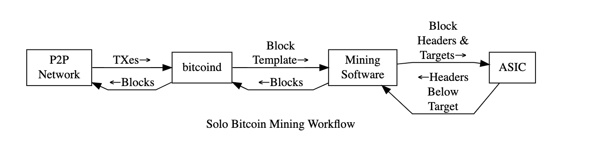
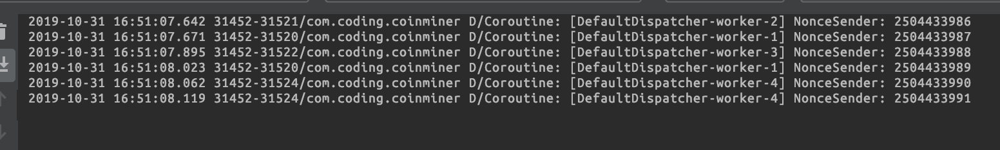

# Blockchain Miner Application ("BrezelCoin")


## Quick Start
- Subfolder `client` includes the src file for the interactive Android application (Minimum platform: Android 9)
- Subfolder `server` includes Node.js server src files, which are currently deployed to http://34.217.130.218:3000/ (AWS) in A Docker environment.
  

## Introduction
A full-stack solution for BrezelCoin mining (a new cryptocurrency introduced in this repo). 

## Problem Details
### Client 
If triggered by the user, requests a bitcoin package from the server (randomly generated), generates the nonce contained in the header and returns the hashed nonce to the server. 

### Server - Bitcoin central service 
Generates a BrezelCoin mining task and sends them to clients if requested. Collects the nonces.

## Bitcoin Topic References

#### [Bitcoin whitepaper](https://bitcoin.org/bitcoin.pdf)

#### [Blockchain Header](https://bitcoin.org/en/developer-reference#block-chain):
```
Block headers are serialized in the 80-byte format described below and then hashed as part of Bitcoin’s proof-of-work algorithm, making the serialized header format part of the consensus rules.
```

#### [Block Hashing Algorithm]


### Mining in Bitcoin 


From https://en.bitcoin.it/wiki/Block_hashing_algorithm:
```The mining software constructs a block using the template (described below) and creates a block header. It then sends the 80-byte block header to its mining hardware (an ASIC) along with a target threshold (difficulty setting). The mining hardware iterates through every possible value for the block header nonce and generates the corresponding hash.

 If a hash is found below the target threshold, the mining hardware returns the block header with the successful nonce to the mining software. The mining software combines the header with the block and sends the completed block to bitcoind to be broadcast to the network for addition to the block chain.


The Merkle root of a block works to provide summarizing hash of list of transactions.
``` 

Code reference: https://analysis.null.place/how-do-the-bitcoin-mining-algorithms-work/#form7:


### Concurrency Implementation (Distributed manner) 

[Coroutines ](https://codelabs.developers.google.com/codelabs/kotlin-coroutines/#3)
[Coffee Shop Visualization](https://proandroiddev.com/kotlin-coroutines-channels-csp-android-db441400965f)
[Producer and Consumer](https://kotlinlang.org/docs/reference/coroutines/channels.html)




### Merkle root

The structure for hashing the transactions.

## Userful Links for Extension
[Blockchain Header](https://learnmeabitcoin.com/explorer/block/0000000000002917ED80650C6174AAC8DFC46F5FE36480AAEF682FF6CD83C3CA) -  How to serialize
[Nodejs Blockchain Header](https://github.com/bitcoin/bitcoin/blob/master/doc/REST-interface.md)

[Samourai Wallet](https://samouraiwallet.com/) – for Bitcoin wallet

[Node Miner](https://www.npmjs.com/package/bitcoin-miner) –  Single thread implementation

[SHA 256](https://stackoverflow.com/questions/7166129/how-can-i-calculate-the-sha-256-hash-of-a-string-in-android) – HASH Function In android

[Difficulty](https://en.bitcoin.it/wiki/Difficulty#What_is_the_formula_for_difficulty) –  How difficulty in the Bitcoin works
[Original Bitcoin](https://en.bitcoin.it/wiki/Original_Bitcoin_client/API_calls_list)


[Bit Core Download]https://snapcraft.io/bitcoin-core

## Application Demo


 Documents for the implementation are in SUBFOLDERS/README.md

 ## Possible enhancements 
- Server side: implement authorization process (started)
- Implement database connection based on different client IDs
- Optimize performance on the client side (started with multithread implementation)

# Copyright
See `LICENSE` file.


 
